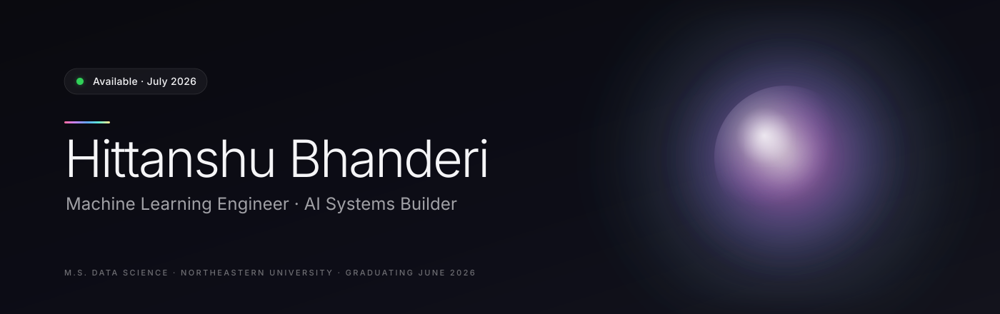
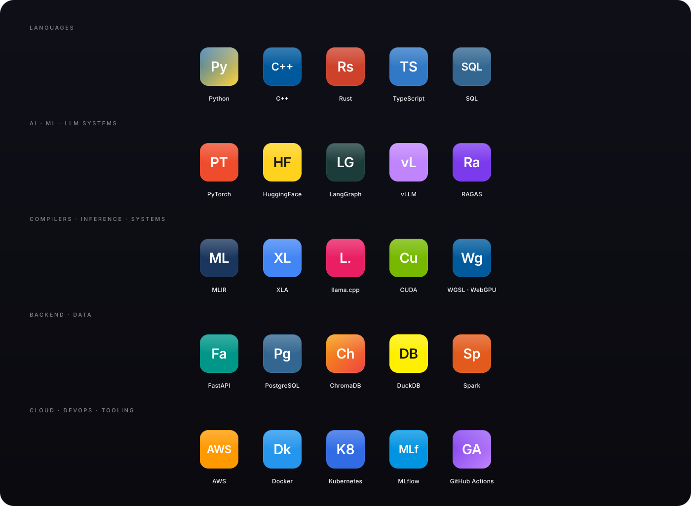
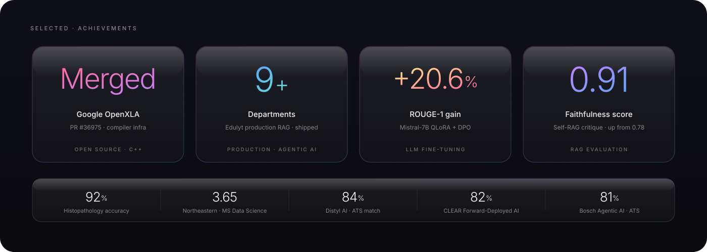

<!-- ============================================================= -->
<!--                          HERO                                 -->
<!-- ============================================================= -->

<p align="center">
  
</p>

<p align="center">
  <a href="https://github.com/hittanshubhanderi20">
    
  </a>
</p>

<p align="center">
  <a href="https://github.com/hittanshubhanderi20"></a>
  &nbsp;
  <a href="https://www.linkedin.com/in/hittanshubhanderi/"></a>
  &nbsp;
  <a href="mailto:bhanderi.h@northeastern.edu"></a>
</p>

<br/>

<!-- ============================================================= -->
<!--                          About                                -->
<!-- ============================================================= -->

## About

> I build AI systems that work in production — not just notebooks.

I'm a Machine Learning Engineer finishing my Master's in Data Science at Northeastern University, focused on **production LLM systems**, **agentic AI**, and **compiler-level inference optimization**. My work sits at the intersection of applied research and shipping software. I care about latency budgets, eval scores, and whether the system is still running at 3 AM.

The short version of what I bring:

— **Production AI systems.** End-to-end agentic RAG pipelines with source attribution and hallucination detection, deployed across 9+ business departments at Edulyt.

— **LLM engineering.** Fine-tuning 7B open-weight models with QLoRA + DPO, automated evaluation via RAGAS / ROUGE / BERTScore, serving with vLLM and FastAPI.

— **Open source at the compiler layer.** Merged C++ contribution to Google's OpenXLA/XLA (PR #36975) — debug tooling for HLO output used by JAX, TensorFlow, and PyTorch/XLA.

— **Systems depth.** Custom MLIR dialect for LLM decoding, browser-native FlashAttention in raw WGSL, and a local-first agentic knowledge base on Apple Silicon.

<br/>

<!-- ============================================================= -->
<!--                       Tech Stack                              -->
<!-- ============================================================= -->

## Tech Stack

<p align="center">
  
</p>

<br/>

<!-- ============================================================= -->
<!--                  AI / ML Expertise                            -->
<!-- ============================================================= -->

## AI / ML Expertise

<div align="center">

| Domain | Level | Detail |
| :--- | :---: | :--- |
| **Large language models** | `████████░░` | Fine-tuning · QLoRA · DPO · prompt engineering · structured outputs · vLLM serving |
| **Retrieval-augmented generation** | `████████░░` | GraphRAG · self-RAG · multi-agent · RAGAS · ChromaDB · token-aware chunking |
| **Agentic AI systems** | `████████░░` | LangGraph · A2A protocol · planner-executor-critic · tool calling · multi-step orchestration |
| **ML systems engineering** | `███████░░░` | Production pipelines · model serving · MLOps · Docker · FastAPI · CI/CD |
| **Compiler & inference optimization** | `███████░░░` | XLA · MLIR · llama.cpp · CUDA · KV-cache · paged attention · speculative decoding |
| **Deep learning** | `███████░░░` | PyTorch · CNN architectures · transformers · medical imaging |
| **LLM evaluation** | `███████░░░` | RAGAS · ROUGE · BERTScore · hallucination detection · faithfulness benchmarks |
| **Data engineering** | `██████░░░░` | ETL · Spark · DuckDB · feature pipelines · vector databases |

</div>

<br/>

<!-- ============================================================= -->
<!--                     Featured Projects                         -->
<!-- ============================================================= -->

## Featured Projects

<details>
<summary>&nbsp;<b>Production Agentic RAG System</b>&nbsp;&nbsp;—&nbsp;&nbsp;<i>deployed across 9+ departments at Edulyt</i></summary>

<br/>

End-to-end **production-grade agentic RAG system** serving as a multi-tenant knowledge layer for 9+ business departments. Implements a **planner-executor-critic** orchestration with **GraphRAG retrieval** and a **self-RAG critique loop** for hallucination detection. **RAGAS-based evaluation** with source attribution and a token-aware chunking gate.

| Stack | Scale | Performance | Reliability | Impact |
| :--- | :--- | :--- | :--- | :--- |
| LangGraph · GraphRAG · ChromaDB · GPT-4o · FastAPI · Docker · Azure | 9+ departments · multi-tenant · production traffic | Context recall **0.71 → 0.84** · Faithfulness **0.78 → 0.91** · p99 latency **−30%** | Source attribution · self-critique retry · token-aware chunking | 40% faster onboarding · 30% cloud cost reduction |

The challenge that earned it production trust: answers started referencing sources that weren't in the retrieved context. Root cause was a tokenizer mismatch between retrieval and generation. The fix was a token-aware chunking layer plus a source-attribution gate that refuses to answer when no retrieved chunk supports the claim. Faithfulness moved from 0.78 to 0.91 — the moment the system became safe to deploy.

</details>

<details>
<summary>&nbsp;<b>OpenXLA / XLA Compiler Contribution</b>&nbsp;&nbsp;—&nbsp;&nbsp;<i>merged into Google's compiler infrastructure</i></summary>

<br/>

Merged a **C++ contribution to Google's OpenXLA/XLA compiler** — the infrastructure that powers **JAX, TensorFlow, and PyTorch/XLA**. Implemented the `xla_hlo_print_inline_stack_frames` debug option, which inlines source-location frames directly in HLO output and eliminates the cross-referencing overhead developers hit when debugging compiled programs.

| Stack | Scale | Review | Status | Link |
| :--- | :--- | :--- | :--- | :--- |
| C++ · Protocol Buffers · HLO IR · XLA Compiler | Used by JAX · TF · PyTorch/XLA | Reviewed by Google maintainers | Merged into `openxla:main` | [`openxla/xla#36975`](https://github.com/openxla/xla/pull/36975) |

Open-source contributions to FAANG-grade compiler infrastructure are rare at the MS level. The PR navigated XLA's internal IR, build system, and Google's code-review culture — credible proxy for "can ramp on any codebase fast."

</details>

<details>
<summary>&nbsp;<b>Mistral-7B Domain Fine-Tuning Pipeline</b>&nbsp;&nbsp;—&nbsp;&nbsp;<i>QLoRA + DPO + vLLM serving</i></summary>

<br/>

End-to-end **domain-specific fine-tuning pipeline** for Mistral-7B on PubMedQA. **QLoRA (4-bit NF4, r=16, α=32, bf16)** for parameter-efficient training, **DPO alignment via TRL** for preference optimization, evaluated with ROUGE + BERTScore + custom benchmarks, served via vLLM + FastAPI + Docker.

| Stack | Scale | Performance | Serving |
| :--- | :--- | :--- | :--- |
| PyTorch · HF PEFT · TRL · bitsandbytes · vLLM · FastAPI · Docker · W&B | 7B params · 5K PubMedQA samples · bf16 | ROUGE-1 **+20.6%** · ROUGE-L **+19.1%** · BERTScore F1 **0.88** | Dockerized · prompt-injection guards · system-prompt sandboxing |

Behind the metrics: TRL shipped six breaking changes during the build — all documented in the repo, including the `DPOTrainer` v0.7 → v0.29 API migration. The W&B run captures the full ablation grid.

</details>

<details>
<summary>&nbsp;<b>MLIR Custom Dialect for LLM Decoding</b>&nbsp;&nbsp;—&nbsp;&nbsp;<i>five compiler operations for inference</i></summary>

<br/>

A **custom MLIR dialect** for LLM decoding operations with five high-level ops, lowering passes to `linalg`/`affine` IR, and **torch-mlir integration**. Designed to expose LLM-specific structure (KV cache, speculative decoding, paged attention) at the compiler level for downstream optimization.

| Stack | Operations | Lowering | Integration |
| :--- | :--- | :--- | :--- |
| MLIR · C++ · LLVM · linalg/affine IR · torch-mlir | `kvcache.alloc` · `kvcache.update` · `speculative.draft` · `speculative.verify` · `paged_attention` | High-level → linalg → affine → LLVM | torch-mlir frontend |

</details>

<details>
<summary>&nbsp;<b>FlashWeb — Browser-Native Tiled FlashAttention in WGSL</b>&nbsp;&nbsp;—&nbsp;&nbsp;<i>WebGPU compute kernels</i></summary>

<br/>

A **browser-native tiled FlashAttention** implementation in raw WGSL (no compiler wrappers). Implements **tiled matrix multiplication**, **online softmax**, and the FlashAttention-2 memory access pattern as a WebGPU compute kernel — runs inside a Chrome tab with no native dependencies.

| Stack | Algorithm | Reference papers | Demo |
| :--- | :--- | :--- | :--- |
| WGSL · WebGPU · JavaScript · Chrome | Tiled FlashAttention-2 · online softmax · shared-memory blocking | FlashAttention (2205.14135) · FlashAttention-2 (2307.08691) · WebLLM (2412.15803) | Live Chrome demo |

</details>

<details>
<summary>&nbsp;<b>LLM Inference Benchmarking Framework</b>&nbsp;&nbsp;—&nbsp;&nbsp;<i>throughput, latency, memory profiling</i></summary>

<br/>

A reproducible **multi-backend LLM inference benchmark suite** covering throughput, p50/p99 latency, memory residency, and quantization-quality impact. Supports **vLLM**, **llama.cpp**, and **HF Transformers** with a shared configuration schema and automated report generation.

| Stack | Backends | Metrics | Reproducibility |
| :--- | :--- | :--- | :--- |
| Python · PyTorch · vLLM · llama.cpp · Triton | vLLM · llama.cpp · HF Transformers | Throughput · p50/p99 latency · memory · ROUGE delta under quantization | Dockerized · seeded · YAML configs |

</details>

<details>
<summary>&nbsp;<b>Personal Brain — Local AI Knowledge Base</b>&nbsp;&nbsp;—&nbsp;&nbsp;<i>local-first, runs on Apple Silicon</i></summary>

<br/>

A **local-first AI knowledge base** running entirely on Apple Silicon. Captures browsing discoveries, enriches them with local LLMs and SearXNG, writes structured notes to Obsidian, indexes everything into ChromaDB, and exposes a FastAPI query interface. **No cloud. No telemetry. Always on.**

| Stack | Sources | Storage | Deployment |
| :--- | :--- | :--- | :--- |
| Ollama · ChromaDB · FastAPI · Obsidian · SearXNG · Docker | YouTube · HN · Wikipedia · Wayback · Stack Overflow · Alpha Vantage | Obsidian markdown + ChromaDB vectors | M2 dev → M1 always-on server (git pull deploys) |

</details>

<details>
<summary>&nbsp;<b>Histopathology Image Classification</b>&nbsp;&nbsp;—&nbsp;&nbsp;<i>tumor detection on gigapixel slides</i></summary>

<br/>

PyTorch **CNN pipeline** for tumor detection and classification on **gigapixel histopathology whole-slide images**. Hyperparameter tuning, advanced inference techniques, and batching optimizations for low-latency deployment in high-stakes medical settings.

| Stack | Scale | Performance | Optimization |
| :--- | :--- | :--- | :--- |
| PyTorch · ResNet · EfficientNet · OpenSlide · CUDA · TensorBoard | Gigapixel whole-slide images | **92% validation accuracy** | Batched inference · CUDA acceleration · throughput tuning |

</details>

<br/>

<!-- ============================================================= -->
<!--                       Experience                              -->
<!-- ============================================================= -->

## Experience

### Machine Learning Engineer Intern  ·  Edulyt India
*Jan 2024 — Jul 2024  ·  Ahmedabad, India*

Owned the full ML lifecycle in production — from problem framing through architecture, implementation, deployment, and stakeholder sign-off — across 9+ real business units. Not a single-model research project; an engineering system with real users.

- Designed and shipped an end-to-end **agentic RAG system** with multi-step orchestration, self-RAG critique loops, and tool-using agents — deployed across 9+ departments.
- Built a **Docker-based ML serving framework** adopted across teams → **40% deployment-cycle reduction**.
- Optimized **TensorFlow Serving** with dynamic batching on Azure → **30% p99 latency reduction**.
- Embedded with non-technical stakeholders across content, support, assessment, analytics, and HR; translated domain requirements into retrieval-pipeline configurations.
- Designed a multi-tenant architecture so new departments onboarded without engineering involvement.

`LangGraph` `GraphRAG` `RAGAS` `ChromaDB` `Azure OpenAI` `FastAPI` `Docker` `TensorFlow Serving` `Python`

---

### Student Software Engineer  ·  Ecommbulls LLP
*May 2022 — Jun 2022  ·  Gandhinagar, India*

E-commerce backend and reliability work — fixed checkout-page abandonment from slow image loading (~20% mobile drop-off), built an inventory alert pipeline, and cleaned up product catalog data quality.

`Python` `SQL` `Backend` `Performance`

<br/>

<!-- ============================================================= -->
<!--                      Achievements                             -->
<!-- ============================================================= -->

## Achievements

<p align="center">
  
</p>

<br/>

<!-- ============================================================= -->
<!--                    GitHub Analytics                           -->
<!-- ============================================================= -->

## GitHub Analytics

<p align="center">
  
  
</p>

<p align="center">
  
  
</p>

<br/>

<!-- ============================================================= -->
<!--                  Contribution Snake                           -->
<!-- ============================================================= -->

## Contribution Activity

<p align="center">
  <picture>
    <source media="(prefers-color-scheme: dark)" srcset="https://raw.githubusercontent.com/hittanshubhanderi20/hittanshubhanderi20/output/github-contribution-grid-snake-dark.svg"/>
    <source media="(prefers-color-scheme: light)" srcset="https://raw.githubusercontent.com/hittanshubhanderi20/hittanshubhanderi20/output/github-contribution-grid-snake.svg"/>
    
  </picture>
</p>

<br/>

<!-- ============================================================= -->
<!--                      Current Focus                            -->
<!-- ============================================================= -->

## Current Focus

```yaml
role:           Machine Learning Engineer
status:         M.S. Data Science · Northeastern · June 2026
location:       Boston, MA → San Francisco, CA
authorization:  F-1 OPT · 3 years · no sponsorship required

learning:
  - MLIR pass infrastructure & dialect lowering
  - WebGPU / WGSL compute kernels (FlashAttention in browser)
  - Distributed training — FSDP, tensor parallelism, Ray
  - CUDA kernel programming fundamentals

building:
  - Personal Brain — local-first AI knowledge base on Apple Silicon
  - FlashWeb — browser-native tiled FlashAttention in WGSL
  - LLM inference benchmarking framework (vLLM · llama.cpp · HF)

exploring:
  - Compiler-level LLM decoding optimizations (KV cache, paged attn)
  - Multi-agent orchestration patterns & A2A protocols
  - RAG evaluation — hallucination detection, source attribution

open_to:
  - Full-time ML / AI Engineer roles starting July 2026
  - LLM Infrastructure & Applied Scientist positions
  - Open-source collaboration on inference systems
```

<br/>

<!-- ============================================================= -->
<!--                         Connect                               -->
<!-- ============================================================= -->

## Connect

<p align="center">
  <a href="mailto:bhanderi.h@northeastern.edu"></a>
  &nbsp;
  <a href="https://www.linkedin.com/in/hittanshubhanderi/"></a>
  &nbsp;
  <a href="https://github.com/hittanshubhanderi20"></a>
</p>

<br/>

<!-- ============================================================= -->
<!--                          Footer                               -->
<!-- ============================================================= -->

<p align="center">
  
</p>
